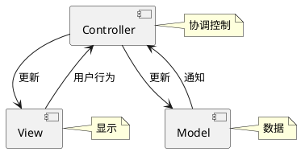
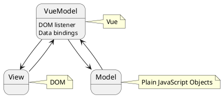

<!-- TOC -->

- [1 artTemplate](#1-arttemplate)
- [vue 引入](#vue-引入)
- [指令](#指令)
- [常用数组的方法](#常用数组的方法)
- [修饰符](#修饰符)
- [按键修饰符](#按键修饰符)
- [组件](#组件)
  - [组件复用](#组件复用)
  - [全局注册组件](#全局注册组件)
- [局部组件注册](#局部组件注册)
- [组件其他属性](#组件其他属性)

<!-- /TOC -->

### 1 artTemplate
- artTemplate.js 用法
一般第三方的放在lib文件夹下面

我们引入template.js
```html
 <script src="./lib/art-template.js"></script>
```
定义动态模板
```html
<!-- 定义动态模板 -->
<!-- 循环：each，变量：list 别名关键字：as，别名：v，索引：i -->
<div id="container">
  <script id="box" type="text/html">
    <h2>{{title}}</h2>
    <ul>
      {{each list as v i}}
      <li>{{v}}</li>
      {{/each}}
    </ul>
  </script>
</div>
```
渲染模板的数据 纯js代码
```html
<!-- 渲染模板的数据 纯js代码 -->
<script>
  var data = {
    title: '标签',
    list: ['文艺', '博客', '摄影', '电影', '民谣', '旅行', '吉他']
  };
  var h = template('box', data);
  console.log(h);
  // 将定义的模板渲染到页面的一个元素上
  document.getElementById('container').innerHTML = h;
</script>
```


Vue 的思想之一：
  一定是你操作数据，数据更新触发 ViewModel， ViewModel 操作DOM
  而不是你直接 document.getElement()   等方法直接操作 DOM

也可以从 npm 上下载
```bash
npm install art-template --save
```

打开 https://cdn.jsdelivr.net/npm/vue/dist/vue.js 复制代码粘贴到 本地新建的 vue.js 中 供我们调用


M-V-VM (Model-View-ViewModel)
***

由经典的软件架构 MVC 衍生来的

***

M-V-VM (Model-View-ViewModel)

***


```puml
[View]

node "VueModel" {
  [DOM listener]
  [Data bindings]
}

database "Model"

[View] -->[DOM listener]
[DOM listener]-->[Model]

[Model]-left->[Data bindings]
[Data bindings]-right->[View]

note top of VueModel : Vue
note left of View : DOM
note right of Model : Plain JavaScript Objects

```

### vue 引入
**1. vue.js在head里面引入程序自上而下执行， 如果将，他会先去执行这段代码，这样渲染dom元素会延迟**

### 指令
{{ }}
属性：用**v-bind**:属性名 或者 :属性名
文本用插值表达式

**v-if**   
**v-on**   v-on:click="show = !show"

**v-for**可以遍历对象和数组
  遍历对象时：
      v-for="v in user"
      v-for="(v, k) in user"
      v-for="(v, k, i) in user"

  遍历数组时：
      v-for="e in emps"
      v-for="(e, i) in emps"

### 常用数组的方法

pop()
push()
shift():删除并返回数组的第一个元素
unshift():向数组的开头添加一个或更多元素，并返回新的长度。
slice()
splice()
产生新数组
  sort():排序
更改原数组

### 修饰符
修饰符(modifier)是以半角句号，指明的特殊后缀，用于指出一个指令应该以特殊方式绑定
```html
<p>.stop  常用</p>
<p>.prevent  常用</p>
<p>.capture</p>
<p>.self</p>
<p>.once</p>
<!-- 阻止单击事件冒泡 -->
<a @click.stop="handle"></a>
<!-- 提交事件不再重载页面 -->
<form @submit.prevebt="handle"></form>
<!-- 修饰符可以串联 -->
<a @click.stop.prevent="handel"></a>
<!-- 只有修饰符 -->
<form @submit.prevebt></form>
<!-- 添加事件侦听器时使用事件捕获模式 -->
<div @click.capture="handle"></div>
<!-- 只有当事件在该元素本身（而不是子元素）触发时触发回调 -->
<div @click.self="handle">...</div>
<!-- 只触发一次，组件同样适用 -->
<div @click.once="handle">...</div>
```

### 按键修饰符
表单元素上监听键盘事件时，还可以使用按键修饰符
```html
<!-- 只有在 keyCode 为 13 时才调用 vm.submit() -->
<input @keyCode="submit">
除了具体的某个 keyCode 外，Vue还提供了一些快捷键名称，以下是全部的别名：
.enter
.tab
.delete(捕获，“删除” 和 “退格” 键)
.esc
.space

.up
.down
.left
.right
```

### 组件
#### 组件复用

__自定义标签就是组件__，每个标签代表一个组件，在任何使用 Vue 的地方都可以直接使用
```js
// 注册的组件自定义标签名称，推荐使用小结加减号分割的形式命名。
// 静态方法可以由类名直接调用
// 全局注册模式 component('标签名',{})
Vue.component('my-component',{
  // 选项
})
```
__组件需要注册后使用__
注册有**全局**和**局部**注册
全局注册：任何 Vue 实例都可以使用

#### 全局注册组件
```html
<div id="app">
    <hello-world></hello-world>
    <hello-world></hello-world>
    <hr>
    <hello-world></hello-world>
</div>

<script src="lib/vue.js"></script>
<script>
  // 全局注册组件
  // Vue.component('hello-world', {
  //     template: '<div><h3>欢迎大家进入vue的世界！</h3><h4>hello</h4></div>'
  // });
  Vue.component('helloWorld', {
      template: '<div><h3 @click="clickHanlder">欢迎{{info}}进入vue的世界！</h3><h4>hello</h4></div>',
      data(){
          return { info: "李明" }
      },
      methods: {
          clickHanlder() { this.info = "王丽"; }
      }
  });

  var app = new Vue({
      el:"#app"
  });
</script>
```
### 局部组件注册
```html
<div id="app">
  <my-components></my-components>
  <hi></hi>
</div>

<script>
  // 这种方式绑定到某个 Vue 实例上
  var Child1 = {
    template: '<div>局部注册组件1的内容</div>'
  }
  var Child2 = {
    template: '<div>局部注册组件2的内容</div>'
  }
  var app = new Vue({
    el:'app',
    components:{
      'my-components': Child1,
      'hi': Child2
    }
  })
</script>
```
### 组件其他属性
除了 template 选项外，组件中还可以像 Vue 实例那样使用其他的选项，比如 data、computed、methods 等
> **但是组件在使用 data 时，和实例稍有区别，data 必须是函数，然后将数据 return 出去**
```html
<script>
  Vue.component('my-componet',{
    template:'<div>{{ message }}</div>',
    data:function(){
      return {message: '组件内容'}
    },
    methods:{
      
    }
  });
  var app = new Vue({
    el:'app'
  });
</script>
```

