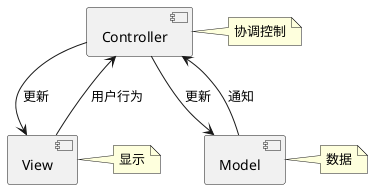
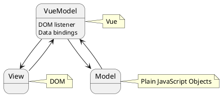

### 1 artTemplate
- artTemplate.js 用法
一般第三方的放在lib文件夹下面

我们引入template.js
```html
 <script src="./lib/art-template.js"></script>
```
定义动态模板
```html
<!-- 定义动态模板 -->
<!-- 循环：each，变量：list 别名关键字：as，别名：v，索引：i -->
<div id="container">
  <script id="box" type="text/html">
    <h2>{{title}}</h2>
    <ul>
      {{each list as v i}}
      <li>{{v}}</li>
      {{/each}}
    </ul>
  </script>
</div>
```
渲染模板的数据 纯js代码
```html
<!-- 渲染模板的数据 纯js代码 -->
<script>
  var data = {
    title: '标签',
    list: ['文艺', '博客', '摄影', '电影', '民谣', '旅行', '吉他']
  };
  var h = template('box', data);
  console.log(h);
  // 将定义的模板渲染到页面的一个元素上
  document.getElementById('container').innerHTML = h;
</script>
```


也可以从 npm 上下载
```bash
npm install art-template --save
```

打开 https://cdn.jsdelivr.net/npm/vue/dist/vue.js 复制代码粘贴到 本地新建的 vue.js 中 供我们调用


M-V-VM (Model-View-ViewModel)
***

由经典的软件架构 MVC 衍生来的

***

M-V-VM (Model-View-ViewModel)

***


```puml
[View]

node "VueModel" {
  [DOM listener]
  [Data bindings]
}

database "Model"

[View] -->[DOM listener]
[DOM listener]-->[Model]

[Model]-left->[Data bindings]
[Data bindings]-right->[View]

note top of VueModel : Vue
note left of View : DOM
note right of Model : Plain JavaScript Objects

```

### vue 引入
**1. vue.js在head里面引入程序自上而下执行， 如果将，他会先去执行这段代码，这样渲染dom元素会延迟**

{{ }}
属性：用**v-bind**:属性名 或者 :属性名
文本用插值表达式

**v-if**   
**v-on**   v-on:click="show = !show"