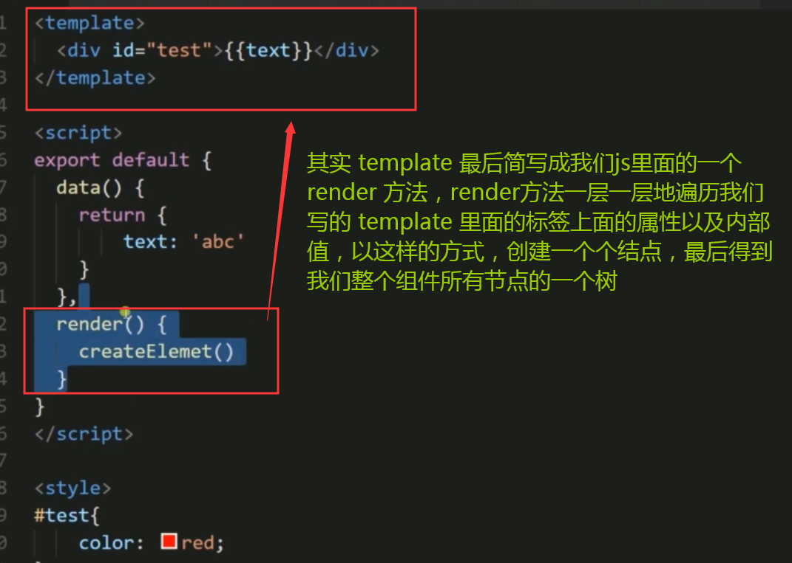

# webpack 要点
webpack.config.js  没有做拆出 css 的处理
webpack.config1.js  用来尝试拆出 css的处理。里面注释 少

[webpack](https://www.webpackjs.com/)
### 1. 只能打包原生且只支持es5语法(所以和bable配合转化es6-->es5)
### 2. 其他文件需要添加 loader依赖文件[参考](https://webpack.js.org/concepts/#loaders)<br>
  ```js
  举个例子需要 为 '.vue' 类型的 文件声明一个 'loader' 因为 'webpack' 不认识 'vue' 
  安装 npm i vue-loader
  ```
### 3. webpack 4.0 把 webpack-cli 拆出来了，所以运行的时候需要自己安装<br>
### 4. 需要 添加 `mode:'development/production'`[参考](https://webpack.js.org/configuration/mode/)
```js
 Set 'mode' option to 'development' or 'production'
```
### 5. 有时候需要添加插件
```js
这里报错配置文件需要VueLoaderPlugin in your webpack config.
ERROR in ./src/app.vue
Module Error (from ./node_modules/vue-loader/lib/index.js):
vue-loader was used without the corresponding plugin. Make sure to include VueLoaderPlugin in your webpack config.
```
```js
import Vue from 'vue' // 导入 vue 这个类库
import App from "./app.vue"// 新建一个挂载 Vue组件的 结点
const root = document.createElement('div')
document.body.appendChild(root)
// 新建一个 Vue 对象 在这个Vue对象中 
// 接收一个 h 参数 这个参数实际上 是 vue中的一个create参数，ton过他把我们的App挂载到 html 里面，这里只是声明了 这个组件渲染出来的app的内容，，挂载这一步还要调用$mount(html结点)
new Vue ({
  render: (h) => h(App) 
}).$mount(root)
```

```js :webpack.config.js
module: {
  rules: [ // rules 是一个数组，可以写很多的 rules
      // text: 文件类型(正则表达式)
      // 它使用的 loader 类型
    { test: /\.vue$/ ,  use: 'vue-loader'  }
  ]
}
```
  
```json
  webpack --config webpack.config.js  写在这里而不是直接把这句话放在，命令行输出是因为，
  命令行它会调用全局的 webpack，全局的 webpack 和该项本地的的可能不一样

  "scripts": {
    "test": "echo \"Error: no test specified\" && exit 1",
    "build": "webpack --config webpack.config.js"
  },
```

## `loader` 和 `use` 的区别
## `loader` 是 `use` 的简写
```js
module: {
  rules: [
    {
      test: /\.css$/,
      // loader: ['style-loader','css-loader?minimize'],      //这是简写
      
      use:[   //使用use 完整写法
          'style-loader',
           {
            loader:'css-loader',
            options: {
              minimize:true,
            }
          },
        ]
    },
// use属性的值需要是个由loader名称组成的数组。Loader的执行顺序是由后到前的。

module:{
  rules:[
    {
      test:/\.css$/,   //正则匹配.css
      use:['style-loader','css-loader?minimize'],   // 从后往前执行
    }
  ]
}
```
## `style-loader` 和 `css-loader` 的 区别
### `style-loader` 把 `css` 加入到 `html` 中<br>
### `css-loader` 就是读取 `css` 样式<br>

## webpack 打包出来的文件内容  分成  上中下三个部分

上部分是webpack的代码

中间部分是你要依赖的代码

最后部分是你的代码


nockout是一个 MVVM 的双向绑定前端类库，被 Angular.js 发扬光大
# VUE2介绍
## 1. 数据绑定
数据绑定的概念 就是我们 js 里面用了一个 Object 或者某种类型的东西去写了一部分数据，但是这部分我们要显示到html上面，一般做法，用js操作dom，然后innerhtml插入页面，以此来显示出来，但是这
样做有一个不方便的地方，操作室是断层的，要修改数据就要重新用js插入一遍，就非常耗费时间**数据绑定**就是帮我们**把js中的数据直接绑定到一部分的html上面**，**数据一旦改变 html上的数据也会改变**

## 2. vue文件开发方式好处
写的App.vue就是一个单独的文件 写了**template**，**script**，**style**，vue2之后可以自定义标签，处理内容，

### 为什么用这种方式开发？因为vue是一个组件化方式的框架，大部分写在页面上的东西，都是由一个一个组件进行拼凑出来的。每个组件由**html**，**css**，**js**组合起来，(这三部分如何更好地处理它)在 react 中我们有jsx很好的帮我们处理了在 js 中书写html，这个 html 通过 <span style="color: #ff0000;">**render**</span> 方法动态生成，每次数据变化他都会执行render方法，动态生成 html， **vue对 jsx 支持不好** 所以自创了在一个文件里面书写组件需要的部分，这样的写法来写组件，而且很直观的看到**数据**和**显示**部分，然后用插值表达式，绑定数据。

## 3. render方法(难点)

>vue2之后，核心实现变成了虚拟 DOM， vue2之后也提供了render 方法，render方法就是一个组件里面有任何数据变化的时候，他都会重新去执行render方法，产生新的 html 以这种方式，更新我们 html 的内容，

>这个我们的vue文件开发模式有什么关系呢？


>其实 template 最后简写成我们js里面的一个 **render 方法** 里面的一个**createElement()**
```js
render(){
  // 一层一层地遍历我们写的 template 里面的标签上面的属性以及内部值，以这样的方式，创建一个个结点，最后得到我们整个组件所有节点的一个树
  createElement()
}
```



# API 重点

## 1. 生命周期方法(因为vue是一个组件)

- 组件什么时候开始被编译
- 组件什么时候开始加载到 DOM 里面
- 组件什么时候销毁

## 2. computed(对于react更深度的使用)

比如在组件内声明了一个人，这个人有姓，名，这两个由用户输入，输出的时候两个组合在一起的样式，这个时候**不想在template里面做字符串拼接**，我们可以声明一个 **computed 方法** 他**retuen 姓 + 名;**
```js
computed(){
  return 姓 + 名;
}
```

# 3-1结尾下一小节：
1. vue实现小demo的一个整体的样式展现
2. 加入业务逻辑
3. 把我们功能实现掉。

## 完善环境，配置**webpack.config.js**

## 安装以下依赖包

```js
npm i postcss-loader autoprefixer babel-loader babel-core

1. postcss-loader
2. autoprefixer
3. babel-loader(`es6转化es5`)
4. babel-core(`babel-loader的依赖包`)

由于 babel-loader 版本太高无法支持 babel-core 所以对 babel-loader降版本处理

5. npm i babel-loader@7 -D
```

根目录下创建`.babelrc`， 
`postcss.config.js`

## `babelrc`
<span style='color:#fff000;'>==========================================================================<br></span>
<span style='color:#fff000;'>==========================================================================<br></span>
## `关于babelwebpack-babel解决babel-loader@8.0.5 requires a peer of @babel/core@^7.0.0 版本兼容的问题`
## 第一套包，相当于babel的转换工具
    npm i babel-core babel-loader babel-plugin-transform-runtime -D
## 第二套包，babel的语法
    npm i babel-preset-env babel-preset-stage-0 -D

## 安装第一个包出现报警告           babel-loader@8.0.5 requires a peer of @babel/core@^7.0.0 原因如下：

### `babel-loader@8.x` is the Webpack integration used for `Babel 7.x.` Babel 7.x has moved all packages from a babel-prefix to the @babel npm scope.

>### 1. 解决办法就是 将`babel-loader@8.x`降级为`babel-loader@7.x`
>### `npm uninstall babel-loader -D`
>### `npm i babel-loader@7 -D`

>### 2. 或者一开始就直接`为babel-loader指定到@7版`本
>### npm i babel-core babel-loader@7 
<span style='color:#fff000;'>==========================================================================<br></span>
<span style='color:#fff000;'>==========================================================================<br></span>
```json
/*
演示 vue 的 render 方法
vue 也可以支持写 jsx 的代码

安装两个包 npm i babel-preset-env babel-plugin-transform-vue-jsx
babel-plugin-transform-vue-jsx 依赖包是 babel-helper-vue-jsx-merge-props 
视频里面 还有一个依赖包是babel-plugin-syntax-jsx但是这里没提示暂时不安装

这里配置完毕，在 webpack 里面也要加上对应的配置
*/
{
  "presets": [
    "env"
  ],
  "plugins": [
    // 转化 vue 里面的 jsx 代码
    "transform-vue-jsx"
  ]
}
```

## `postcss.config.js`
```js
const autoprefixer = require('autoprefixer')
// stylus 把 .styl文件编译成 css 文件
// 然后 postcss 优化 css 代码
// 优化过程通过一系列组件 
// 现在用到的是 autoprefixer(自动添加浏览器前缀 -webket，-moz，-ms，-o)
module.exports = {
  plugins: [
    autoprefixer()
  ]
}
```

# 3-2结尾下一节，正式书写App的代码

## 去掉之前的如下测试代码

```js
import './assets/styles/test.css'
import './assets/styles/test-stylus.styl'
import './assets/images/dog.jpg'
```
```html
<div id="test">{{ text }}</div>
```
```js
data() {  return { text: "abcde" };}
```
```css
#test { color: #ff0000; }
```
# 新建一个 todo 文件夹，然后按照 [todo.md](../src/todo/todo.md) 配置配置为完毕，返回该页


先完成 header 
```html
<template>
	<div class="main-header">
		<h1>JTodo</h1>
	</div>
</template>
```
```css
<style lang="stylus" scoped>
.main-header {
	text-align: center;
	h1 {
		font-size: 100px;
		color: rgba(175, 47, 47, 0.4);
		font-size: 100px;
		margin: 20px;
	}
}
</style>
```
App.vue 引入这句话，然后在组件内注册该组件
```javascript
import Header from './todo/header.vue'
export default {
	components: {
		Header
	}
}
```
## 在 template 里面引用该组件
```html
<template>
	<div id="app">
		<div id="cover"><!-- 做背景虚化 --></div>
		<Header></Header>
	</div>
</template>
```

## 父子组件传值必考题
TodoList里面 删掉每一个 item 就是触发 todo.vue 的状态

这是父子组件数据交互的一个关系，他们两个如何进行数据的联通
以及交互？

父组件通过 props 把值传入子组件，并且监听子组件所有会触发的事件，一旦触发事件，对应的父组件就能操作

## 父子组件事件解耦，子组件定义自己的事件，父组件根据，子组件的emit 自定义的事件 通过 `@事件名称 = "方法"`
在vue中组件内实现的任何事件触发的一个操作在父组件内都可以使用一个 @事件名称 = "方法"
 
子组件通过事件的方式告诉父组件我这边要做的某种操作

**我们可以在 父组件的 props 里面声明一个方法，然后父组件通过props把对应的 delete 方法传递子组件**

**然后在子组件里面触发这个事件的时候去调用父组件的删除方法**

**现在流行的是 emit 触发一个事件 两个参数，第一个是事件的名称**
**第二个是 事件参数(这里把我们要删除的参数传递给父组件)**
**this.$emit('del',this.todo.id)**
 

 **父组件 通过 props 把东西传递给子组件**
 **子组件 通过 事件 的方式 告诉 父组件我这边要做某种操作**
 父组件引入子组件，在script标签 components 中注册好，在template模板语法里面使用，在父组件的 data 里面声明一个值，在子组件引入注册的的标签上绑定这个值
 切换到子组件的页面，在子组件的 script 标签中 props 对象里面新建一个值，这个值命名为父组件传递进来的值。就可以使用了。而且这个值是不能进行修改的，除非写一个方法监听这个值，父组件监听这个方法获得值然后自己新建方法对这个值进行修改，或者用计算属性对他进行计算然后显示
 **vue 中有很多方法 我们可以在 props 里面声明一个方法 然后 父组件通过 props 把对应的 delete 方法传递进来**
 **在子组件里面触发这个事件的时候，去调用父组件的删除方法**

 **现在流行：this.$emit('del',this.todo.id)** 

安装一个依赖包，用来拆分出css
  npm i extract-text-webpack-plugin  这个版本报错，采用下面这个指令
  npm i -D extract-text-webpack-plugin@next


  /* 跑npm的时候设置一个环境变量，标识目前是开发环境还是生产环境
  安装一个 cross-env 的包 设置环境变量 
           |<-指令->| |<----环境变量---->|
  "build": "cross-env NODE_ENV=production webpack --config webpack.config.js",

  防止平台不同 为了每个平台都去配置一个指令

  没有安装 cross-env
  "build": "webpack --config webpack.config.js",
  "dev": "webpack-dev-server --config webpack.config.js"

  安装了 cross-env
  "build": "cross-env NODE_ENV=production  webpack --config webpack.config.js",
  "dev": "cross-env NODE_ENV=development  webpack-dev-server --config webpack.config.js"
 */


 ## [webpack中hash、chunkhash、contenthash区别](https://www.cnblogs.com/giggle/p/9583940.html)


 ## 第三方类库单独打包
 更长时间的利用客户端缓存，减少服务器的流量，让用户加载速度更快
 所以把自己引入的库文件额外打包
 单独拆分打包
 设置不同的入口文件
