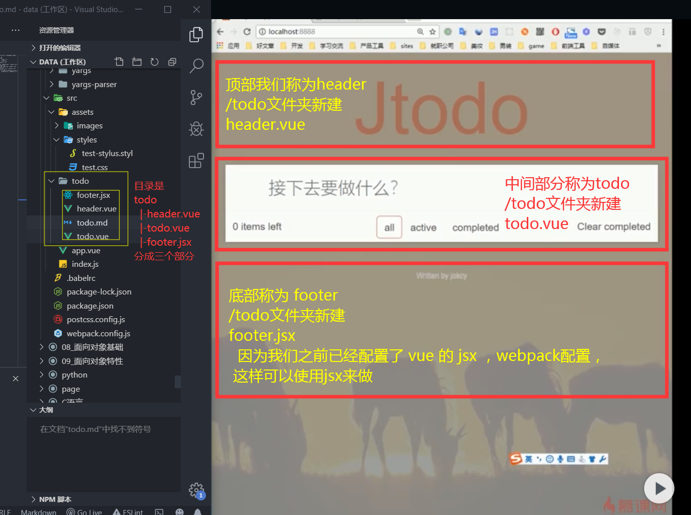

todo 文件夹里面放我们的 todo应用

目录是
todo
  |-header.vue
  |-todo.vue
  |-footer.jsx
分成三个部分

顶部我们称为header /todo文件夹新建 header.vue
中间部分称为todo /todo文件夹新建 todo.vue
底部称为 footer /todo文件夹新建 footer.jsx 
  因为我们之前已经配置了 vue 的 jsx ，webpack配置， 这样可以使用jsx来做

  

  ## 然后 todo 里面也要细分

  ## 下面部分是一个完整的组件包含一些帮助的`按钮`以及`tabs`

  ## `tabs.vue`

  ## 每加一行都会出现新的一行，新出现的一行作为一个组件，因为它要循环出来的 `item.vue`

  ## 主要讲 vue和webpack的使用不会在样式上 讲解

  ## 在 `src/assets/styles` 下面新建一个 `global.styl`文件
  # [返回note.md](../../markdown/note.md)