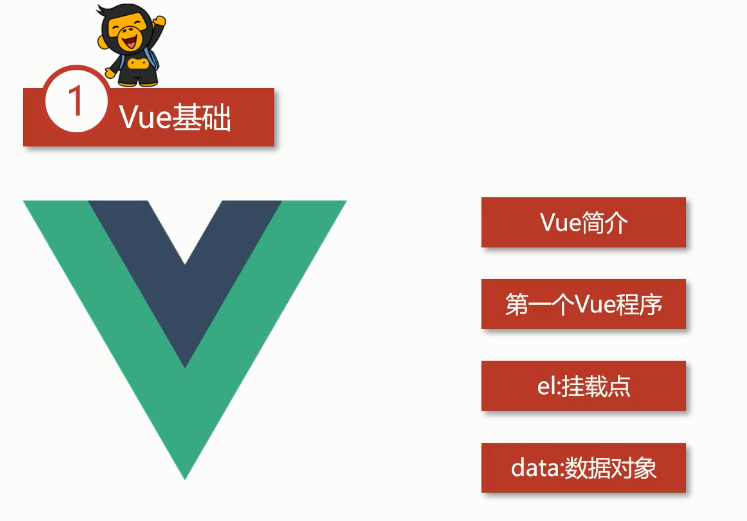

# `Vue 学习笔记`(4个小时带你快速入门vue)

- ## `01`. 课程介绍

#### 学前须知
  - 1. **html** 
  - 2. **css** 
  - 3. **javascript** 
  - 4. **ajax** 无刷新与服务器交互数据

#### 开发工具
  - 1. **vscode** 
  - 2. 插件：**Live Server**(代码保存自动刷新页面)


# `Vue基础简介`

-  ## `02`. Vue基础简介-简介



### 1. javascript框架

### 2. 简化Dom操作
    (Dom 对象(文档对象模型): 指的是HTML 页面的元素)

### 3. 响应式的数据驱动
    (页面是由数据来生成的，当数据改变以后，页面会同步的更新，这部分结合代码理解)


- ## `03`. Vue基础简介-第一个Vue程序

 **`[Vue官方中文文档](https://cn.vuejs.org/)`**

```js
<!-- 开发环境版本，包含了有帮助的命令行警告 -->
<script src="https://cdn.jsdelivr.net/npm/vue/dist/vue.js"></script>
```
```js
<!-- 生产环境版本，优化了尺寸和速度 -->
<script src="https://cdn.jsdelivr.net/npm/vue"></script>
```
Vue.js 的核心是一个允许采用简洁的模板语法来声明式地将数据渲染进 DOM 的系统：
>`新建一个页面 `
>1. `第一步导入开发版本的 Vue.js`
```js
<!-- 开发环境版本，包含了有帮助的命令行警告 -->
<script src="https://cdn.jsdelivr.net/npm/vue/dist/vue.js"></script>
```

>2. `新建标签 new 一个Vue 对象 挂载 el 元素`
```js
var app = new Vue({
  // el 属性 告诉 Vue 对象，去管理 id名 为 app的元素
  // # 是 id选择器
  el: '#app',
  // data对象 是 Vue实例 里面用到的数据
  data: {
    message: 'Hello Vue!'
  }
})
```

>3. `使用简洁的模板与法把数据渲染到页面上`
```html
<div id="app">
  <!-- 两个大括号是插值表达式 把数据和页面结构关联 -->
  {{ message }}
</div>
```

- ## `04`. Vue基础简介-el挂载点(设置Vue实例挂载(管理)的元素)

  - 1. Vue 实例的作用范围是什么呢？
```
只在el对象命中的 DOM 元素 及其内部后代元素
```
  - 2. 是否可以使用其他选择器？
```
可以，一般使用 id 选择器，因为 开发时候 id 选择器是唯一的，其他选择器 可以重复使用 造成语义的不清晰
```
  - 3. 是否可以使用其他的 DOM 元素？
```
可以，只能支持双标签，假如标签内部有子元素，否则单标签即可
但是不能挂载到 html 和 body 这两个双标签上
建议使用 div元素 因为它没有额外的样式
```
- ## `05`. Vue基础简介-data数据对象

1. `data`属性又称为数据对象，可以有`复杂数据`
2. Vue 用到的数据定义在 data 中
3. 渲染复杂类型数据，遵守`js语法`即可

```html
<!-- 使用简洁的模板与法把数据渲染到页面上 -->
  <div id="app">
    {{ message }}
    <!-- "." 点语法把对象属性的值拿出来 -->
    <h2>{{ school.name }} {{ school.mobile }}</h2>
    <ul>
      <!-- 数组取元素 数组名[索引] -->
      <li>{{ campus[0] }}</li>
      <li>{{ campus[1] }}</li>
      <li>{{ campus[2] }}</li>
      <li>{{ campus[3] }}</li>
    </ul>
  </div>
```

```js
var app = new Vue({
  el: '#app',
  data: {
    message: 'Hello Vue!',
    school:{
      name: "ywj",
      mobile: "17857072877"
    },
    campus:["北京", "上海", "广州","深圳"]
  }
})
```

# `本地应用`

- ## `06`. 本地应用-介绍

- ## `07`. 本地应用-v-text指令

- ## `08`. 本地应用-v-html指令

- ## `09`. 本地应用-v-on指令基础

# `计数器`
- ## `10`. 本地应用-计数器

- ## `11`. 本地应用-v-show指令

- ## `12`. 本地应用-v-if指令

- ## `13`. 本地应用-v-bind指令

- ## `14`. 本地应用-图片切换

- ## `15`. 本地应用-v-for指令

- ## `16`. 本地应用-v-on补充

- ## `17`. 本地应用-v-model指令

# `小黑记事本`

- ## `18`. 本地应用-小黑记事本-介绍

- ## `19`. 本地应用-小黑记事本-新增

- ## `20`. 本地应用-小黑记事本-删除

- ## `21`. 本地应用-小黑记事本-统计

- ## `22`. 本地应用-小黑记事本-清空

- ## `23`. 本地应用-小黑记事本-隐藏

# `网络应用`(Vue 常见的一个网络请求库)

- ## `24`. 网络应用-介绍

- ## `25`. 网络应用-axios基本使用

- ## `26`. 网络应用-axios加vue

# `天知道`

- ## `27`. 网络应用-天知道-介绍

- ## `28`. 网络应用-天知道-回车查询

- ## `29`. 网络应用-天知道-点击查询

# `综合应用`(结合所学知识，和一个免费开源的接口实现一个音乐播放器)

- ## `30`. 综合应用-介绍

- ## `31`. 综合应用-音乐查询

- ## `32`. 综合应用-音乐播放

- ## `33`. 综合应用-歌曲封面

- ## `34`. 综合应用-歌曲评论

- ## `35`. 综合应用-播放动画

- ## `36`. 综合应用-播放mv

- ## `37`. 总结


