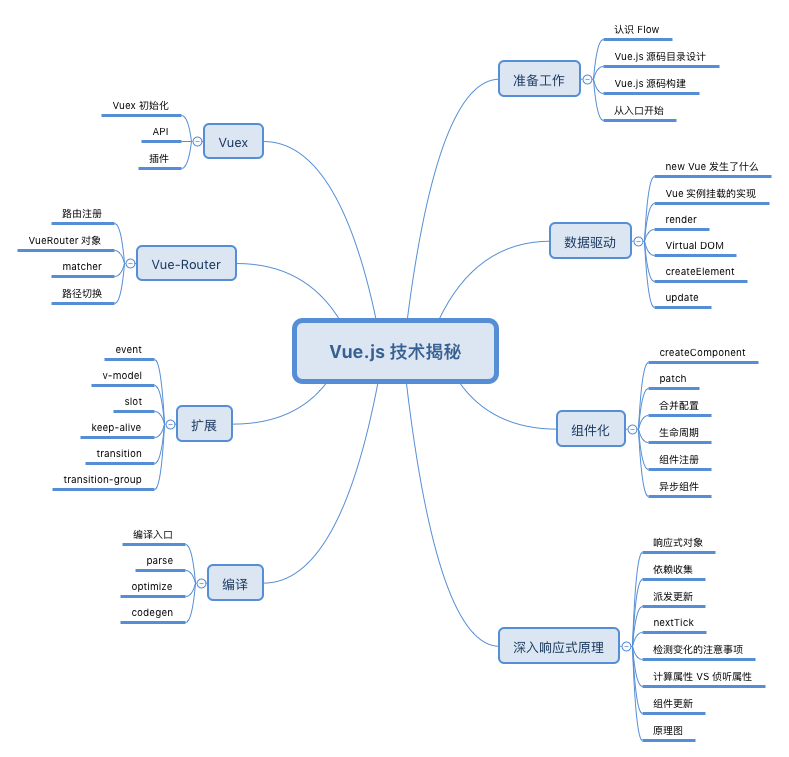

本人仓库(https://github.com/shanliangdeYWJ)
# Vue 源码解析([慕课网视频](https://coding.imooc.com/class/228.html)，本人不是原作者，只是做视频笔记)



## 类型检测工具 [Flow](https://flow.org/en/docs/getting-started/)
## 本教程采用的 [Flow电子书教程](https://github.com/ustbhuangyi/vue-analysis/tree/master/docs)


### `1. 安装 Flow`
```javascript
npm install -g flow-bin  // 这个是全局安装 会安装在你的全局仓库里，

npm install  flow-bin  // 如果是想安装在项目里面 不从全局读取的话可以运行这句
```

### 2. 使用 Flow 之前创建 [.FlowConfig](./\.flowconfig) 文件
### `代表你不想对哪些文件做检查`
```javascript
flow init  
```

### [01index.md](./markdown/01index.md)
### [02flow.md](./markdown/02flow.md)
### [03directory.md](./markdown/03directory.md)
### [04build.md](./markdown/04build.md)
### [05entrance.md](./markdown/05entrance.md)